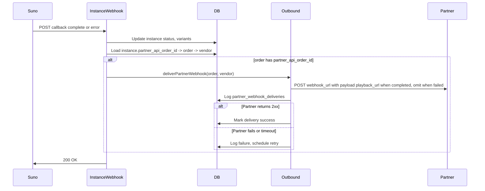

# Partner API — Phase 1: Templated song only

This document is the single reference for **Phase 1 implementation**: templated orders only. It covers schema, APIs (GET /templates, POST /orders for templated, GET /orders/:id, GET /orders list), webhook with **playback_url** only, and the vendor player page. **No custom order APIs** (lyrics, confirm-and-generate, cancel, etc.) are in scope.

---

## Scope

- **In scope:** Basic schema (vendors, credentials, orders, pricing, webhook log), API-key auth, GET /templates (paginated), POST /orders (`customer_templated_song`), GET /orders/:id, GET /orders (list), outbound webhook on completion/failure with **playback_url** when completed (omit when failed), vendor player page at `/vendor/[vendorSlug]/[songSlug]`, sandbox mode, webhook retries, admin and docs.
- **Out of scope for Phase 1:** Custom song (lyrics + song), GET/PATCH /orders/:id/lyrics, POST /orders/:id/confirm-and-generate, POST /orders/:id/cancel, lyrics_ready webhook. Those are Phase 2.

---

## Current state

- **Templated songs:** [templated_songs](src/lib/db/schema.ts) with many-to-many to **categories** via `templated_song_categories`. Categories use `slug` (e.g. `weddings`, `birthday`). [GET /api/templated-songs](src/app/api/templated-songs/route.ts) supports `?categorySlug=...`.
- **Generate flow:** [POST /api/templated-songs/generate](src/app/api/templated-songs/generate/route.ts) accepts `templateId`, `name`; creates a row in `templated_song_instances`, calls Suno, returns `slug` and `taskId`. Identity is user or anonymous (no vendor/API key).
- **Completion:** [suno-webhook/templated-songs/instances](src/app/api/suno-webhook/templated-songs/instances/route.ts) updates instance status and variants on Suno callback; **no outbound webhook** to partners today.
- **Partners:** [partnersTable](src/lib/db/schema.ts) exists for UTM/attribution; no API keys or B2B orders.
- **Auth:** No API-key auth; only session/NextAuth for users.

---

## Recommendation: same repo and database

Use the existing Melodia repo and PostgreSQL database. Do not split into multiple services. Reuse templated-songs list, generate flow, and instance webhook; add API-key auth, partner order entity, outbound webhook (playback_url only), and vendor player page. Split later only if scale or team structure justifies it.

---

## Target capabilities

| # | Capability | Approach |
|---|------------|----------|
| 1 | Fetch templated songs by occasion | Partner API wraps existing list; filter by categorySlug (occasion); paginated. |
| 2 | Create order and generate song (templated) | New partner order; create instance, link order to instance; return order id and status. Webhook sends **playback_url** only. |
| 3 | Webhook on completion/failure | Instance webhook: when completed/failed, POST to webhook_url with **playback_url** when completed (omit when failed); retries and signing. |
| 4 | Vendor player page | Route `https://melodia-songs.com/vendor/{{vendor_slug}}/{{song_slug}}`; playback_url only, no song_url or source_audio_url. |
| 5 | Analytics and audit | Query partner orders by vendor and date; use existing logging. |
| 6 | Receivables | Store amount_charged and currency per order; report by vendor/date. |
| 7 | Configurable price per product per vendor | Table vendor × product_type (and optional template_id); apply when creating order. |

---

## Data model (Phase 1)

All changes via **Drizzle migrations**.

- **partner_api_vendors:** `id`, `name`, `slug` (unique), `webhook_url` (optional), `webhook_secret`, `sandbox` (boolean), `active`, `created_at`, `updated_at`.
- **partner_api_credentials:** `id`, `vendor_id` (FK), `key_hash`, `name`, `last_used_at`, `expires_at` (nullable). Multiple keys per vendor for rotation.
- **partner_api_orders:** `id`, `vendor_id` (FK), `external_order_id`, `product_type` (at least `customer_templated_song`), `template_id` (FK templated_songs), `templated_song_instance_id` (nullable FK), `recipient_name`, `webhook_url` (optional override), `status` (`pending` | `processing` | `completed` | `failed`), `amount_charged`, `currency`, `metadata`, `idempotency_key` (unique per vendor), `created_at`, `updated_at`, `completed_at`. Phase 1 does not need lyrics_ready/cancelled or extra FKs for implementation; they can be nullable for future Phase 2.
- **partner_api_product_prices:** `vendor_id`, `product_type` (e.g. `customer_templated_song`), `product_id` (nullable; template_id for per-template price), `price`, `currency`, `active`, `created_at`, `updated_at`. Resolution: per-template row if present, else vendor default for product_type.
- **partner_webhook_deliveries:** `id`, `order_id`, `vendor_id`, `attempt`, `status_code`, `success`, `request_body` (or hash), `response_snippet`, `created_at`.
- **templated_song_instances:** Add nullable `partner_api_order_id` (FK to partner_api_orders). Do **not** add partner_api_order_id to user_songs or song_requests in Phase 1.

---

## API design (Phase 1)

- **Base path:** `/api/v1/partner`. **Auth:** `Authorization: Bearer <api_key>`. Middleware: hash key, lookup in partner_api_credentials (check expires_at), attach vendor_id to context; 401 if invalid. All queries filter by vendor_id (vendor isolation).
- **Base URL:** `https://api.melodia-songs.com`. See [PARTNER_API_SUBDOMAIN.md](PARTNER_API_SUBDOMAIN.md) for hosting.
- **Vendor identification:** API key identifies the vendor; no separate vendor ID in requests.

**Endpoints:**

1. **GET /api/v1/partner/templates?occasion=...&page=1&limit=20**  
   Same data as GET /api/templated-songs with `categorySlug=occasion`. Query: `occasion` (optional), `page` (default 1), `limit` (default 20, max 100). Response: `templatedSongs` array and `pagination`: `{ page, limit, total_count, total_pages, has_next_page, has_previous_page }`.

2. **POST /api/v1/partner/orders**  
   Body: `product_type: "customer_templated_song"`, `external_order_id`, `template_id`, `recipient_name`, `webhook_url?`, `idempotency_key?`, `metadata?`. Validate template; resolve price from partner_api_product_prices; create order + templated_song_instance (with partner_api_order_id), call Suno; return `order_id`, `status` (e.g. `song_generation_inprogress`), `estimated_completion_minutes`. On Suno failure set order to `failed`. **Sandbox:** When vendor is sandbox, use DEMO_MODE; when `metadata.simulate === "failure"`, create order then mark failed and send order.failed webhook.

3. **GET /api/v1/partner/orders/:id**  
   Return order and status; when completed include **playback_url** only: `https://melodia-songs.com/vendor/{{vendor_slug}}/{{instance_slug}}`. Do not expose song_url or source_audio_url.

4. **GET /api/v1/partner/orders?from=&to=&status=&cursor=&limit=**  
   List orders for vendor with filters and cursor-based pagination (e.g. cursor=<last_order_id>, limit=50, max 100). When completed include playback_url only.

**Webhook payload:** When POSTing to partner webhook_url on completion or failure: standard envelope with `event` (`order.completed` | `order.failed`), `timestamp`, `order_id`, `external_order_id`, `product_type`, `data`. When **completed:** include `playback_url` (`https://melodia-songs.com/vendor/{{vendor_slug}}/{{instance_slug}}`), `song_title`, `instance_slug`, `completed_at`, `amount_charged`, `currency`. When **failed:** omit playback_url; include `error_message`, `completed_at`, amount/currency. **Do not send song_url or source_audio_url.** Signing: HMAC-SHA256 of body with webhook_secret; header `X-Melodia-Webhook-Signature`.

**Playback URL:** Partners receive only playback_url. Audio is played via the Melodia player page. Internally persist source_audio_url for the player; do not expose in API or webhook.

**Sandbox:** Same base URL; vendor-level sandbox (sandbox boolean on partner_api_vendors). Simulated failure via `metadata.simulate === "failure"` in POST /orders (sandbox only).

**Rate limiting:** Per API key; e.g. GET /templates 100/min, POST /orders 30/min. Return 429 with Retry-After.

**Idempotency:** For POST /orders, Idempotency-Key or body idempotency_key; return 200 with existing order if same vendor+key.

**Error format:** `{ "error": { "code": "...", "message": "...", "request_id": "..." } }`.

---

## Vendor player page

- **URL:** `https://melodia-songs.com/vendor/{{vendor_slug}}/{{song_slug}}`. Example: `https://melodia-songs.com/vendor/winni/happy-birthday-rahul`.
- **vendor_slug:** From partner_api_vendors.slug.
- **song_slug:** From templated_song_instances.slug (Phase 1).
- **Implementation:** Route `/vendor/[vendorSlug]/[songSlug]`. Resolve vendor by slug (404 if not found or inactive). Resolve templated_song_instance by songSlug; verify instance has partner_api_order_id and that order belongs to this vendor (partner_api_order_id → order → vendor_id). 404 if not found or access denied. Render existing Melodia player component with instance data (variants, audio URLs from DB—exposed only in this server-rendered page, not in Partner API).

---

## Completion webhook flow



- **Outbound webhook module** (e.g. src/lib/partner-api/outbound-webhook.ts): Build payload with event envelope; when completed include playback_url; when failed omit playback_url. Sign with HMAC, POST to webhook_url (10s timeout), log to partner_webhook_deliveries. Called from [suno-webhook/templated-songs/instances](src/app/api/suno-webhook/templated-songs/instances/route.ts) when callbackType is complete or error and instance has partner_api_order_id; also update partner_api_orders.status and completed_at.
- **Retries:** 5 attempts at 30s, 5m, 30m, 2h, 24h; 10s timeout per attempt. After exhausted, mark delivery exhausted; partner can poll GET /orders/:id. Manual replay via support. Partners use order_id + event + timestamp to deduplicate.

---

## Implementation order

1. **Schema and migrations:** partner_api_vendors (slug, sandbox), partner_api_credentials (expires_at), partner_api_orders (product_type `customer_templated_song`, template_id, templated_song_instance_id, recipient_name, status, etc.), partner_api_product_prices (product_type `customer_templated_song`), partner_webhook_deliveries; add partner_api_order_id to templated_song_instances.
2. **Auth middleware:** Resolve API key, validate, attach vendor_id; enforce vendor isolation.
3. **GET /api/v1/partner/templates:** Wrap templated-songs list with API-key check, occasion → categorySlug, pagination (page, limit, pagination object).
4. **POST /api/v1/partner/orders (templated):** Create order + instance, call Suno, link order to instance; handle failures; sandbox and metadata.simulate === "failure".
5. **Instance webhook extension:** On complete/error, if partner_api_order_id set, update order status and completed_at, call deliverPartnerWebhook with playback_url when completed (omit when failed).
6. **Outbound webhook module:** deliverPartnerWebhook builds envelope, signs, POSTs, logs; playback_url only when completed.
7. **Vendor player page:** Route /vendor/[vendorSlug]/[songSlug]; resolve vendor and instance; verify ownership; render player.
8. **GET /api/v1/partner/orders/:id** and **GET /api/v1/partner/orders:** List/detail scoped to vendor; when completed include playback_url only.
9. **Sandbox mode:** When vendor.sandbox true, use DEMO_MODE; support metadata.simulate === "failure".
10. **Webhook retry cron:** Background job for failed deliveries (respect schedule, retry up to 5).
11. **Admin:** CRUD for vendors (with slug), credentials, product prices (`customer_templated_song`); analytics/receivables.
12. **Docs:** Update PARTNER_API.md with playback_url only, vendor player URL, Phase 1 scope.

---

## Failure scenarios (Phase 1)

1. **Suno API call fails:** POST /orders (templated); set order to failed, store failed_step in metadata; return 500 SONG_GENERATION_FAILED. Partner retries with new order.
2. **Suno webhook reports task failure:** callbackType error; update instance and order to failed; fire order.failed webhook (omit playback_url).
3. **Suno webhook never arrives:** Stale order cron: find orders in processing > N min, poll Suno; update order and fire webhook or mark failed with timeout error.
4. **Outbound webhook delivery fails:** Log in partner_webhook_deliveries; retry per schedule; after exhausted partner can poll GET /orders/:id.
5. **Template not found or inactive:** Return 400 TEMPLATE_NOT_FOUND; no order created.
6. **Price not configured:** Return 400 PRICE_NOT_CONFIGURED; no order created.
7. **Invalid or expired API key:** Return 401 UNAUTHORIZED.
8. **Idempotency conflict:** Return 200 with existing order.
9. **Vendor isolation:** Return 404 for order belonging to another vendor.
10. **Database write failure:** Return 500 INTERNAL_ERROR; partner retries with new idempotency key.
11. **Rate limit exceeded:** Return 429 RATE_LIMIT_EXCEEDED with Retry-After.
12. **Sandbox simulated failure:** POST /orders with metadata.simulate === "failure" (sandbox only); create order, mark failed, send order.failed webhook with demo error_message.

---

## Error response format

```json
{
  "error": {
    "code": "TEMPLATE_NOT_FOUND",
    "message": "Human-readable description.",
    "request_id": "req_abc123"
  }
}
```

- `code`: Machine-readable. `message`: Safe to display. `request_id`: For support.

---

## Summary

- **Phase 1 = templated orders only.** Same repo and database. No custom order APIs.
- **APIs:** GET /templates (paginated), POST /orders (templated), GET /orders/:id, GET /orders (list). All require API key; vendor isolation.
- **Webhook:** playback_url only when completed; omit when failed. No song_url or source_audio_url to partners.
- **Vendor player page:** `/vendor/[vendorSlug]/[songSlug]`; validate vendor and instance ownership; render Melodia player.
- **Schema:** partner_api_vendors (with slug, sandbox), partner_api_credentials, partner_api_orders, partner_api_product_prices, partner_webhook_deliveries; partner_api_order_id on templated_song_instances only.
