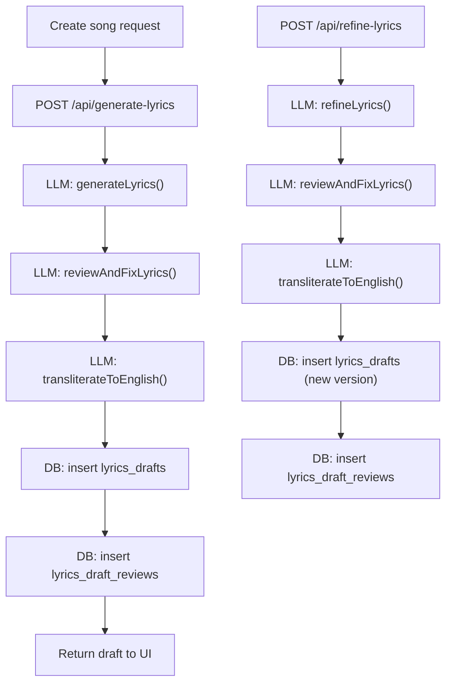

# Lyrics generation, review, transliteration, and storage (Melodia)

This document describes the **current end-to-end flow** for lyrics generation and refinement, including **where each step runs**, **what is stored**, and **which tables are affected**.

---

## High-level pipeline

Key principle:
- **We only store `lyrics_drafts` after the review layer completes** (generation + refine flows).
- Manual edits (`/api/update-lyrics`) intentionally **do not run review**.

---

## Core tables (storage model)

### `song_requests`
- Created when the user submits the form.
- Relevant columns used in lyrics flows:
  - `id`
  - `recipient_details`
  - `occasion`
  - `languages` (string, e.g. `"Hindi, English"`, `"Hinglish"`)
  - `mood` (array)
  - `song_story`
  - `lyrics_edits_used`
  - `selected_lyrics_draft_id`
  - `status`

### `lyrics_drafts`
Stores **versioned drafts** of lyrics (the core persisted artifact).
- Relevant columns:
  - `id`
  - `song_request_id`
  - `version`
  - `original_version_id` (tracks lineage when refined/edited)
  - `customer_lyrics` — display lyrics (Latin-script/transliterated); what the user sees and edits
  - `model_ready_lyrics` — audio-model-ready format (native script, proper structure); populated **only at approval time** via `craftAudioModelLyrics()`, not at generation time
  - `song_title`, `music_style`, `description`, `language`
  - `llm_model_name`
  - `lyrics_edit_prompt` (refine instruction, if applicable)
  - `status` (`draft` / `approved` / etc.)
  - `custom_lyrics` (true if user-provided)

> **Two-phase architecture**: `customer_lyrics` is written during generation/refinement. `model_ready_lyrics` is derived from `customer_lyrics` at approval time — this separation lets users edit display lyrics without corrupting the audio-model format.

### `lyrics_draft_reviews` (1:1 with `lyrics_drafts`)
Stores compact review metadata without bloating `lyrics_drafts`.
- Relationship:
  - `lyrics_draft_reviews.lyrics_draft_id` → `lyrics_drafts.id` (**FK**, **UNIQUE**, cascade delete)
- Relevant columns:
  - `review_report` (jsonb): compact scores, flags, edit plan summary, applied edits
  - `review_model_name`
  - `reviewed_at`

Migration: `drizzle/migrations/0051_shiny_joystick.sql`

---

## Generation flow (AI lyrics)

### Entry point
**API route**: `src/app/api/generate-lyrics/route.ts` (`POST /api/generate-lyrics`)

**Input (request body)**:
- `songRequestId` (number)
- optional: `language`, `refineText` (currently not the main refinement path; refinement is handled by `/api/refine-lyrics`)

### Step 1: Load request context (DB read)
The API loads the `song_requests` row and optional “style matching” context from `songs` if `source_song_id` is present.

**DB reads**:
- `song_requests` (by `id`)
- optional: `songs` (by `source_song_id`) to fetch `lyrics` for style matching

### Step 2: Generate base lyrics (LLM)
**Service**: `src/lib/services/llm/llm-lyrics-operation.ts` → `generateLyrics(formData)`

**Prompt builder**: `src/lib/services/llm/prompts/lyrics-opeation-prompt-builder.ts`
- Enforces:
  - square-bracket headers like `[Verse 1]`, `[Chorus]` (instrumental headers allowed)
  - native script rules for multilingual lyrics
  - minimum coverage guidance for multi-language requests (at least two full lines in each requested language)
  - “Quality Gate” checklist (structure, singability, punctuation constraints)

**Model**:
- Uses Vertex AI via `@google-cloud/vertexai`
- JSON-mode output: `responseMimeType: 'application/json'`
- `DEMO_MODE=true` returns mock lyrics (no external LLM call)

### Step 3: First-draft validations (server-side)
After parsing LLM JSON, the output is validated in `llm-lyrics-operation.ts` (via `validateOutput(...)`).

Current validations include:
- minimum lyric length
- **square-bracket headers present** (and no mixed `(...)` + `[...]`)
- must include at least `[Verse]` and `[Chorus]`
- Hindi punctuation rule (no `!` on Devanagari lines)

If validation fails, the generation function retries with a lower temperature (attempt 2).

### Step 4: Review + auto-fix (LLM)
**Service**: `src/lib/services/llm/llm-lyrics-review.ts` → `reviewAndFixLyrics({ lyrics, context })`

This runs as a **pipeline layer** (not an “agent”) and is intentionally **deterministic**:
1. **Review (single LLM call)** → returns strict JSON containing only **exact text replacements** (`before` → `after`)
2. **Server applies replacements** only when the `before` text matches **uniquely** in the lyrics (to avoid accidental broad rewrites)
3. **Validate fixed lyrics** (structure/script/punctuation); if invalid, the request fails and nothing is stored

`DEMO_MODE=true` returns the original lyrics as-is, with a `demo_mode` flag in the report.

### Step 5: Transliteration for display (LLM)
**Service**: `src/lib/services/llm/llm-lyrics-transliteration.ts` → `transliterateToEnglish({ text, languages, recipientDetails })`

Purpose:
- Create `customer_lyrics` (Latin-script) for display/editing in the UI

Properties:
- Uses a lightweight model for transliteration
- Preserves line breaks and section headers (square bracket style)
- **Proper-noun spellings**: When `recipientDetails` is passed (from the song request), proper nouns (especially the recipient’s name) in the lyrics must be transliterated using **exactly the spelling the user provided**—no phonetic reinterpretation. This keeps names consistent with what the user typed (e.g. “Priya”, “Preeya”) in both Hindi/Devanagari (for SUNO) and the transliterated customer lyrics.
- If transliteration fails, the API returns `503` and **does not write a draft**

### Step 6: Persist (DB write; atomic transaction)
The API stores the post-reviewed output in a transaction:
1. Insert into `lyrics_drafts` (final lyrics = reviewed/fixed lyrics)
2. Insert into `lyrics_draft_reviews` (compact review report)
3. Update `song_requests.status` (currently set to `processing`)

**Stored values**:
- `lyrics_drafts.customer_lyrics`: transliterated lyrics (Latin-script) — what users see
- `lyrics_drafts.model_ready_lyrics`: **NOT set here** — populated only at approval time
- `lyrics_draft_reviews.review_report`: compact JSON report (only when `LYRICS_REVIEW_ENABLED=true`)

The API returns the new draft ID and display lyrics to the client.

---

## Refinement flow (AI refine)

### Entry point
**API route**: `src/app/api/refine-lyrics/route.ts` (`POST /api/refine-lyrics`)

**Input (request body)**:
- `lyricsDraftId` (number)
- `editPrompt` (string)

### Step 1: Load draft + request (DB reads)
- Load existing `lyrics_drafts` row by `lyricsDraftId`
- Load the associated `song_requests` row by `song_request_id`

### Step 2: Check package edit limits (DB read)
The API fetches package data (`packages.allowed_lyrics_edits`) and compares to `song_requests.lyrics_edits_used`.

If exceeded → returns `403` without calling LLMs.

### Step 3: Refine lyrics (LLM)
**Service**: `src/lib/services/llm/llm-lyrics-operation.ts` → `refineLyrics({ currentLyrics, refineText, songRequest })`

**Prompt builder**: `src/lib/services/llm/prompts/lyrics-opeation-prompt-builder.ts`
- Keeps square bracket headers
- Must preserve structure and multilingual constraints
- Quality gate checks (headers/script/punctuation)

### Step 4: Review + auto-fix (LLM)
Same review layer as generation: `reviewAndFixLyrics`.

### Step 5: Transliteration (LLM)
Same transliteration layer as generation: `transliterateToEnglish`.

### Step 6: Persist new version (DB write; atomic transaction)
In one transaction:
1. Insert a new `lyrics_drafts` row with:
   - `version = nextVersion`
   - `original_version_id` set (tracks lineage)
   - `customer_lyrics = transliteratedLyrics` (display)
   - `model_ready_lyrics = null` (set only at approval)
   - `lyrics_edit_prompt = editPrompt`
2. Insert `lyrics_draft_reviews` row linked to the new draft
3. Increment `song_requests.lyrics_edits_used`

Returned to UI:
- the new draft id and its display (`customer_lyrics`)

---

## Manual edit flow (no review)

### Entry point
**API route**: `src/app/api/update-lyrics/route.ts` (`POST /api/update-lyrics`)

**Behavior**
- Creates a new `lyrics_drafts` version via `src/lib/lyrics-display-actions.ts` → `updateLyricsAction(...)`
- **No review layer runs here** by design
- (Currently) no transliteration step is enforced in this path

---

## Custom lyrics flow (user-provided)

### Entry point
**API route**: `src/app/api/process-custom-lyrics/route.ts` (`POST /api/process-custom-lyrics`)

### Behavior
- Runs `processCustomLyrics(...)` to normalize scripts and proper nouns (e.g., Devanagari for names)
- Writes `lyrics_drafts` with:
  - `custom_lyrics = true`
  - `status = approved` (because user provided their own lyrics)
  - `customer_lyrics = original user input` (display)
  - `model_ready_lyrics = processed version` (native-script output from `processCustomLyrics()`)
- **This path currently does not run the review layer** (it’s intended to preserve user text; you can add review later if desired).

---

## Section header conventions

The system expects (and now prompts for):
- **Square bracket headers** on their own lines: `[Verse 1]`, `[Chorus]`, `[Bridge]`, `[Outro]`
- Optional: `[Intro]`, `[Pre-Chorus]`, `[Hook]`, etc.
- Optional instrumental/stage-direction: `[Guitar Solo - soft and romantic]`

Legacy parentheses headers `(Verse 1)` are treated as legacy and are filtered in some timestamp-processing utilities, but generation/refine/review pipelines are standardized on `[ ... ]`.

---

## Logging, timing, and demo mode

### Logging
- `src/lib/logger/api-middleware.ts` provides `withApiLogger()` and `createApiTimer()`
- `POST /api/generate-lyrics` and `POST /api/refine-lyrics` emit timing markers for key stages (generate/refine, review, transliteration, db writes)

### Review feature flag
The review layer is controlled by an environment flag:
- `LYRICS_REVIEW_ENABLED=true` → enable review (`reviewAndFixLyrics`) and store `lyrics_draft_reviews`
- **default** (unset/false) → review is skipped and no `lyrics_draft_reviews` row is created

### Demo mode
Setting `DEMO_MODE=true`:
- disables real LLM calls in generation/refinement and review layer (returns mock/skips)
- transliteration returns original text in demo mode

---

## What is stored “at each step” (summary)

Generation (`/api/generate-lyrics`):
- **No DB write** until review + transliteration succeed
- Then, in one transaction:
  - `lyrics_drafts` inserted (post-reviewed lyrics)
  - `lyrics_draft_reviews` inserted (report)
  - `song_requests.status` updated

Refine (`/api/refine-lyrics`):
- **No DB write** until refine + review + transliteration succeed
- Then, in one transaction:
  - new `lyrics_drafts` version inserted (post-reviewed lyrics)
  - `lyrics_draft_reviews` inserted
  - `song_requests.lyrics_edits_used` incremented

Manual edit (`/api/update-lyrics`):
- new `lyrics_drafts` version inserted
- no review record created

