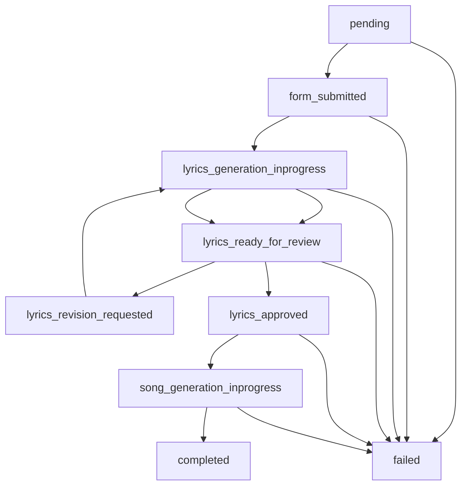
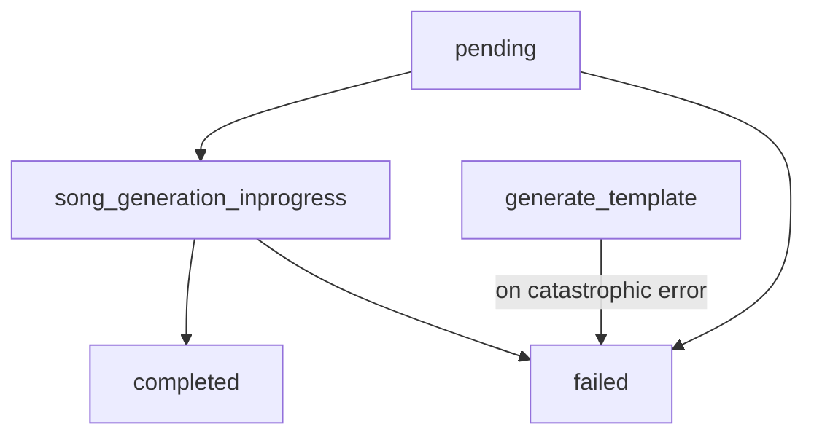
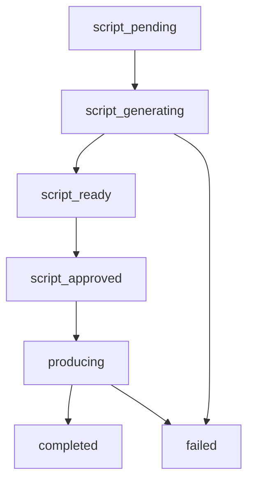

# Partner vendor orders: statuses by product type

This document describes how order and product state evolve for co-branded **Partner API** customer flows. Source of truth for DB enums: [`src/lib/db/schema.ts`](../src/lib/db/schema.ts) (`partner_api_order_status`, `rj_show_status`, and related tables).

## Two levels of state

1. **Partner order** — row in `partner_api_orders` (field `status`). The same status enum is shared by all product types, but **not every value is used** by every product. Values and comments are defined in the schema.
2. **Product-specific record** — additional status on the child entity the UI and APIs use for progress:
   - **Custom song** — `song_requests`, `lyrics_drafts`, `user_songs` (lyrics and Suno).
   - **Templated song (customer UI)** — `templated_song_instances` (Suno job + variants).
   - **RJ show** — `rj_shows` (script → production). The co-branded page is driven mainly by `rj_shows.status`; the partner order often stays in a single coarse state until the show finishes.

`GET /api/vendor-order/{orderToken}` (see [`src/app/api/vendor-order/[orderToken]/route.ts`](../src/app/api/vendor-order/[orderToken]/route.ts)) may return an **effective** `order.status` for `customer_custom_song` and `customer_templated_song` when generation is in progress, by inferring `completed` / `failed` from the linked `user_song` or templated instance.

---

## Shared enum: `partner_api_orders.status`

| Status | Meaning (high level) |
|--------|------------------------|
| `pending` | Order created; customer has not started the on-site flow (or, for some flows, not finished the one customer step). |
| `form_submitted` | Form submitted; used by **custom song** as an intermediate step before lyrics generation runs. |
| `lyrics_generation_inprogress` | Lyrics LLM in progress (**custom song**). |
| `lyrics_ready_for_review` | Lyrics available for review (**custom song**). |
| `lyrics_revision_requested` | Customer asked for an AI revision; generation will run again (**custom song**). |
| `lyrics_approved` | Lyrics approved; about to / starting Suno (**custom song**). |
| `song_generation_inprogress` | Suno / audio in progress (primarily **custom** and **customer templated**). |
| `completed` | Terminal success. |
| `failed` | Terminal failure. |
| `processing` | **Legacy / coarse in-progress** — still used for **RJ show** (order stays here for most of the pipeline) and some **partner-direct templated** flows. |

---

## 1. `customer_custom_song` (fully custom, co-branded)

**What the customer does:** open link → fill story/lyrics form → (optional) revise lyrics → approve → wait for the song.

**Main transitions (partner order):**

| Transition | Trigger (typical) |
|------------|--------------------|
| `pending` → `form_submitted` | `POST /api/vendor-order/{token}/submit` (creates `song_request`, then async work continues). |
| `form_submitted` → `lyrics_generation_inprogress` | Async `triggerLyricsGeneration` updates order when LLM work starts. |
| `lyrics_generation_inprogress` → `lyrics_ready_for_review` | Lyrics (and draft rows) ready; order updated on success. |
| `lyrics_ready_for_review` → `lyrics_revision_requested` | `POST .../revise-lyrics` (customer request). |
| `lyrics_revision_requested` / review → `lyrics_generation_inprogress` | Revision pipeline runs; then back toward review when a new draft exists. |
| `lyrics_ready_for_review` → `lyrics_approved` | `POST .../approve-lyrics`. |
| `lyrics_approved` → `song_generation_inprogress` | Song generation (Suno) started after approval. |
| `song_generation_inprogress` → `completed` | Suno success + `user_song` completed; `GET` may expose effective `completed` when the child row is done. |
| → `failed` | Errors in submission, lyrics, approval, or Suno; also **watchdog** auto-fail for orders stuck in `form_submitted` or `lyrics_generation_inprogress` (see `STUCK_STATUSES` / timeout in the vendor-order `GET` handler). |

**Related entity signals:** `lyrics_drafts` versions, `song_requests.status`, `user_songs.status` and `song_variants` (including stream-ready before full completion).

**Deeper step-by-step and UI mapping:** [VENDOR_FLOW.md](./VENDOR_FLOW.md).

**Client polling (co-branded page):** while `order.status` is in a transient set (e.g. form submitted through song generation, plus legacy `processing` if it appears), the custom-song flow polls `GET /api/vendor-order/{token}` on a fixed interval so the screen advances when the backend updates.

---

## 2. `customer_templated_song` (name-in-template, co-branded)

**What the customer does:** open link → pick template and recipient name → **Generate**; then wait for audio.

**Main transitions (partner order):**

| Transition | Trigger (typical) |
|------------|--------------------|
| `pending` | Order created by Partner API (`createTemplateSongOrder` in [`order-creators.ts`](../src/lib/partner-api/order-creators.ts)). |
| `pending` → `song_generation_inprogress` | `POST /api/vendor-order/{token}/generate-template` (sets in-progress, then async instance + Suno). |
| `song_generation_inprogress` → `completed` | Templated instance reaches completed variants; `GET` vendor-order may return effective `completed` from instance / polling helpers. |
| → `failed` | Generation or Suno path fails (instance or order updated depending on code path). |

**Related entity:** `templated_song_instances.status` — typically `processing` while Suno runs, then `completed` or `failed`. Variants may become stream-ready while still `processing`.

**Client polling:** while `order.status` is `song_generation_inprogress` or `processing` (legacy), the templated flow polls the vendor-order endpoint.

---

## 3. `rj_show` (AI radio-style show)

Here the **RJ pipeline status** is authoritative for the customer experience. The partner order is set to **`processing` at order creation** (see `createRjShowOrder` in [`order-creators.ts`](../src/lib/partner-api/order-creators.ts)) and is moved to **`completed` when final audio is uploaded** in `produceShow` in [`rj-show-service.ts`](../src/lib/services/rj-show-service.ts). If production fails, **`rj_shows.status`** becomes `failed` (and the UI should surface that from `rj_show`); the partner order row may still show `processing` in some failure paths, so do not rely on order status alone for RJ failures.

**`rj_shows.status` lifecycle (app orchestration):**

| `rj_shows.status` | Meaning |
|-------------------|--------|
| `script_pending` | Show row created; script generation not started or not yet updated. |
| `script_generating` | LLM is generating the script (`generateScript`). |
| `script_ready` | Script stored; customer can review and **approve** (vendor order page: `POST .../rj-show/approve` when `show.status === 'script_ready'`). |
| `script_approved` | Approved script stored; **production** is triggered (async). |
| `producing` | Segments processed (TTS, songs, stitch); long-running. |
| `completed` | Final MP3 URL available (`final_audio_url`). |
| `failed` | Unrecoverable error (e.g. script generation or a segment / stitch step). Check `error_message` / `failed_step` on the show. |

| Transition | Trigger (typical) |
|------------|--------------------|
| `script_pending` → `script_generating` | Start of `generateScript`. |
| `script_generating` → `script_ready` | LLM success; optional outbound `order.script_ready` style webhook. |
| `script_ready` → `script_approved` | `approveScript` (from customer page or partner API) validates and stores the approved script. |
| `script_approved` → `producing` | `produceShow` begins. |
| `producing` → `completed` | Final upload; partner order set to `completed`, completion webhook. |
| → `failed` | See service error handling and segment failures. |

**Partner order for RJ:** remains `processing` for most of the life of the show, then `completed` on success.

**Client polling:** poll while `rj_show` is in a transient script/production status, and while the order is `processing` but `rj_show` is not yet returned or still loading (implementation lives under the RJ show flow). Transitions to terminal `rj_show` states stop polling for progress.

---

## 4. `customer_templated_song` — partner-driven create (template + recipient in POST)

**Behavior:** If the partner passes **`template_id`** and **`recipient_name`** on **`POST /api/v1/partner/orders`**, Melodia starts Suno immediately (`song_generation_inprogress`), creates a `templated_song_instances` row, and advances the order via instance/webhook paths — the customer link may open straight into generating/listening rather than a template picker.

If **`template_id`** is omitted, the flow stays **`pending`** until the customer opens **`customer_link`** and completes template selection on the co-branded page (same product type).

See [`order-creators.ts`](../src/lib/partner-api/order-creators.ts) (`createTemplateSongOrder`) and instance completion under `/api/templated-songs/instances/...`.

---

## Quick reference: which file encodes what

| Concern | Location |
|---------|----------|
| Partner order status enum | [`src/lib/db/schema.ts`](../src/lib/db/schema.ts) `partnerApiOrderStatusEnum` |
| RJ show status enum | same file, `rjShowStatusEnum` |
| Custom song HTTP transitions | `src/app/api/vendor-order/[orderToken]/submit`, `.../revise-lyrics`, `.../approve-lyrics`, Suno webhook + vendor-order `GET` |
| Customer templated generate | `src/app/api/vendor-order/[orderToken]/generate-template` |
| RJ orchestration | [`src/lib/services/rj-show-service.ts`](../src/lib/services/rj-show-service.ts) |
| Enriched `GET` response and Suno polling side effects | [`src/app/api/vendor-order/[orderToken]/route.ts`](../src/app/api/vendor-order/[orderToken]/route.ts) |
| Co-branded UI (polling ownership per flow) | `src/app/vendor/[vendorSlug]/order/[orderToken]/_flows/*` |

---

## Related reading

- [VENDOR_FLOW.md](./VENDOR_FLOW.md) — custom song end-to-end (detail).
- [Architecture: templated songs (consumer vs partner)](./architecture-templated-songs.md) — if present; consumer hub differs from partner `customer_templated_song`.

When in doubt, follow the code paths that **write** `partner_api_orders.status` and the linked child row for that `product_type`.
